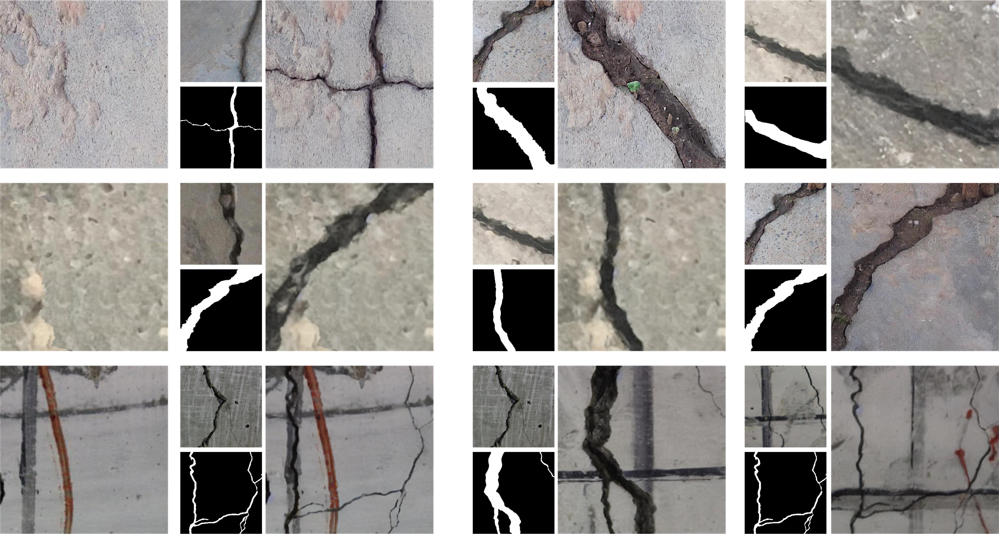

CRDM ：a controllable Crack Reference-based Diffusion Model
====
A model can accurately synthesize high-quality and diverse cracks on crack-free background images by leveraging predefined masks and reference images.  



# Requirements
```
pip install -r requirement.txt
```
# Pretrained Model
Downloaded the [PBE pretrained model](https://drive.google.com/file/d/15QzaTWsvZonJcXsNv-ilMRCYaQLhzR_i/view?usp=share_link)
# Training
### The data structure is like this:
```
dataset
├── BeamCrack
│  ├── images
│  │  ├── xxx.jpg
│  │  ├── ...
│  ├── masks
│  │  ├── train_0
│  │  │  ├── xxx.png
│  │  │  ├── ...
```
### To train a new model, you can use train.py
# Testing
### To generate new images, you can use test.py
